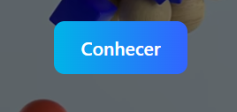
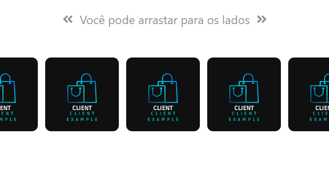
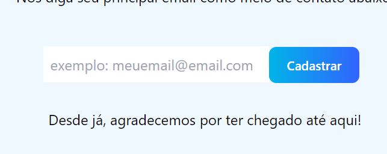

  
  <h1>English Version</h1>

<h2>T2S Services: AI and Machine Learning: The Guide</h1> 
<h3>Installation Guide (for studies)</h1>
<ul>
  <li>
    
Clone and acess the frontend folder separately:

    <pre class="language-bash">
      $ git clone https://github.com/PedroTintino/T2S-private
       
      $ cd T2S-private
       
      $ cd frontend
    <pre>
  </li>
  <li>
    
Install the dependecies inside this folder (use --force if you have any trouble):

    <pre class="language-bash">
      npm install
    </pre>
  </li>
  <li>
    <h2>Usage</h2>
    
Once you have sucefully created/installed your dependencies, you'll be able to run it using the follow commands:

    <pre class="language-bash">
      //For your client-side (frontend)
      $ npm run dev
    </pre>
  </li>
</ul>

Now let's discover how to use our software properly, aiming a better user experience.

<h2>Interactive Spots</h2>
<ol>
  <li>
    <h2>Read More Button</h2>
    
First things first, you can easily scroll-down to our content using this button.

    
  </li>
  <li>
    <h2>Hamburger Menu</h2>
    
Once you're using it from a mobile device this menu will be displayed.
 
     
  </li>
  <li>
    <h2>Our Clients Slider</h2>
    
You're able to see our clients draggin' it to side

    
  </li>
  <li>
    <h2>Leads Form</h2>
    
Our contact form

    
  </li>
</ol>
<h2>If you having any trouble running it, please contact me at https://www.linkedin.com/in/pedro-vieira-0b59a01b1/</h2>
<h3>Enjoy it!</h3>

  
  <h1>Brazilian Portuguese Version</h1>

<h2>T2S Serviços:Ia e Machine Learning: O Guia</h1> 
<h3>Guia de Instalação (para estudos)</h1>
<ul>
  <li>
    
Clone e acesse a pasta frontend separadamente:

    <pre class="language-bash">
      $ git clone https://github.com/PedroTintino/T2S-private
       
      $ cd frontend
    <pre>
  </li>
  <li>
    
Installe as dependências dentro dessa pasta (use --force se você estiver tendo algum problema de compatibilidade):

    <pre class="language-bash">
      npm install
    </pre>
  </li>
  <li>
    <h2>Uso</h2>
    
Uma vez que você tiver instalado com sucesso suas dependências, você estará apto a rodar a aplicação usando o seguinte comando: 

    <pre class="language-bash">
      //For your client-side (frontend)
      $ npm run dev
    </pre>
  </li>
</ul>

Agora falaremos sobre como utilizar a aplicação corretamente para a melhor experiência do usuário.

<h2>Pontos Interativos</h2>
<ol>
  <li>
    <h2>Botão de Conhecer</h2>
    
Primeiramente, você pode utilizar esse botão para a função de scroll automática para o conteúdo da página.

    
  </li>
  <li>
    <h2>Hamburger Menu</h2>
    
Uma vez que você esteja acessando a partir de um dispositivo móvel, essa opção será renderizada.
 
     
  </li>
  <li>
    <h2>Our Clients Slider</h2>
    
Um slider com a função de arrastar para os lados com nossos principais clientes

    
  </li>
  <li>
    <h2>Leads Form</h2>
    
Meio de contato com possíveis clientes.

    
  </li>
</ol>
<h2>Caso encontre qualquer dificuldade em utilizar a aplicação, não hesite em entrar em contato comigo em https://www.linkedin.com/in/pedro-vieira-0b59a01b1/</h2>
<h3>Aproveite!</h3>

